# CampusPulse — System Architecture

**Version:** 2.0 (Draft)
**Derived from:** CampusPulse PRD v2.0 (Workshop Intervention Expansion)
**Scope:** Frontend ↔ Backend ↔ Database ↔ AI architecture, including the College-Led Workshop Intervention System

> **Convention used in this document:** items taken directly from the PRD are stated as requirements. Items marked **(proposed)** are architectural choices made here because the PRD does not specify them (for example, workshop API routes and new collections). Review these before implementation.

---

## 1. Architecture Overview

CampusPulse is an AI-powered placement-readiness and intervention platform. Its operational loop, extended in v2 by workshops, is:
```text
Measure → Detect → Group → Intervene → Train → Reassess → Measure Improvement → Prepare for Drive
```
The system has four tiers:

| Tier | Technology | Responsibility |
|---|---|---|
| **Frontend** | React, Vite, TypeScript, shadcn/ui, Tailwind CSS | Role-based UI, assessment/interview/proctoring clients, workshop registration and analytics |
| **Backend** | Node.js, Express.js, REST (`/api/v1`) | Auth, business logic, orchestration, cohort targeting, job management |
| **Database** | MongoDB Atlas | Primary system of record |
| **AI/ML** | LLM provider, Computer Vision service, deterministic engines, optional Python ML | Readiness, skill gaps, recommendations, interviews, proctoring, resume |

**Design principles**

1. Node.js/Express is the primary application and API layer; Python ML services are separate and optional.
2. The MVP readiness model is a **transparent weighted score**, not a black-box ML model.
3. Long-running AI and analytics work is **asynchronous** (job pattern).
4. AI output is schema-validated; resumes are checked against verified profile data.
5. Proctoring is a **decision-support signal**, never automatic proof of misconduct.
6. Workshop impact metrics are **descriptive**, not causal claims.
7. Fail safely and never lose assessment submissions.

---

## 2. High-Level System Architecture

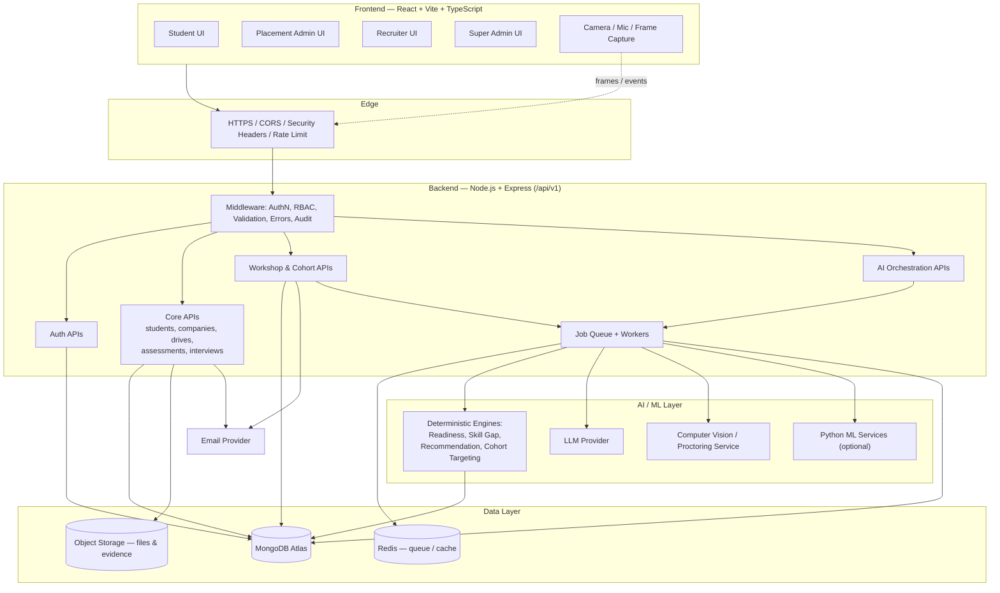

### Simplified view (matches PRD §20)

```text
        React + Vite + TypeScript
                  │
                  ▼  HTTPS / JSON
      Node.js + Express.js REST API
                  │
        ┌─────────┼──────────┐
        ▼         ▼          ▼
   Core APIs   AI/ML APIs  Auth APIs
   (+ Workshop)
        │         │          │
        └─────────┼──────────┘
                  ▼
           MongoDB Atlas
```

---

## 3. Frontend Architecture

### 3.1 Stack

React · Vite · TypeScript · shadcn/ui · Tailwind CSS

Recommended supporting libraries: React Router (routing), TanStack Query (server state), React Hook Form + Zod (forms/validation), Recharts (analytics charts).

### 3.2 Structure

```text
src/
├── app/                  # App shell, router, providers
├── components/
│   ├── ui/               # shadcn/ui primitives
│   └── shared/           # DataTable, ReadinessGauge, SkillGapChart, CohortSizePreview, etc.
├── features/             # One folder per domain
│   ├── auth/
│   ├── students/
│   ├── companies/
│   ├── drives/
│   ├── assessments/      # timer, autosave, proctoring hooks
│   ├── interviews/       # media capture
│   ├── readiness/
│   ├── skill-gaps/
│   ├── recommendations/
│   ├── workshops/        # (new) builder, targeting, enrollment, attendance, impact
│   ├── cohort-analytics/ # (new) skill-gap aggregation views
│   ├── resumes/
│   ├── analytics/
│   └── notifications/
├── layouts/              # StudentLayout, AdminLayout, RecruiterLayout
├── lib/
│   ├── api/              # Typed API client
│   ├── auth/             # Token handling, route guards
│   └── utils/
├── hooks/
├── types/                # Shared TypeScript contracts
└── styles/
```

### 3.3 Role-Based Screens

| Role | Screens |
|---|---|
| **Student** | Dashboard, Profile, Companies, Drives, Assessments, Interviews, Readiness, Skill Gaps, Recommendations, Resume, Notifications, **Workshops** *(new)* |
| **Placement Admin** | Command Dashboard, Students, Recruiters, Drives, Assessments, Interviews, AI Matching, Reports, Settings, **Skill-Gap Analytics, Workshops, Intervention Reports** *(new)* |
| **Recruiter** | Company Dashboard, Job Descriptions, Candidates, Shortlisting, Assessments, Interviews, Reports |
| **Super Admin** | Organizations, Users, Roles/Permissions, Configuration, Audit |

> The PRD's v2 screen lists were not updated for workshops; the new screens above are derived from §37 **(proposed)**.

### 3.4 Workshop UI Components

**Placement Admin**

| Screen | Behavior |
|---|---|
| **Skill-Gap Analytics** | Ranked skills by affected-student count, filter by drive/branch/semester, risk distribution, recommended intervention size, "Create workshop" action pre-filled from the selected gap |
| **Workshop Builder** | Title, type, target skills, schedule, capacity, instructor, mode (venue/meeting link), linked drives, pre/post-assessment, targeting rules |
| **Targeting panel** | Rule builder (skill, score threshold, gap priority, drive, branch, semester, CGPA, readiness range, risk level) with a **live projected cohort size** and manual add/remove |
| **Lifecycle control** | Publish / unpublish / cancel, open/close registration, mark completed |
| **Attendance** | Per-session roster with present/absent and timestamp |
| **Impact report** | Attendance rate, completion rate, avg skill improvement, avg readiness improvement, threshold-cleared count, remaining at-risk list, one-click follow-up intervention |
| **Drive view** | Skill gap × students affected × workshop needed (Yes / Optional / Recommended) |

**Student**

| Screen | Behavior |
|---|---|
| **Workshop card** | Title, *why you were selected* (score vs. required score), target skill, linked drive, instructor, date/time, duration, mode, venue/link, seats, **Register** button |
| **My Workshops** | Registration/waitlist status, attendance, pre/post-assessment status, improvement score, updated readiness, next recommended action |

### 3.5 Key Frontend Responsibilities

- **Route guards:** protected routes by role; the backend remains the source of truth for authorization.
- **API client:** attaches the access token, silently refreshes on `401`, retries idempotent calls, maps errors to user-friendly messages.
- **Async AI/analytics UX:** submit request → receive `jobId` → poll (or SSE) → render result; progress, timeout and retry states.
- **Assessment client:** server-authoritative countdown, **autosave every N seconds**, refresh/offline recovery, duplicate-submit prevention.
- **Proctoring client:** explicit consent, throttled frame capture, permission-denied handling.
- **Interview client:** `MediaRecorder`/WebRTC capture, chunked upload, reconnect handling.
- **Workshop registration:** optimistic UI for register with reconciliation on `409` (duplicate) or `409 FULL` (capacity), waitlist state display.
- **Accessibility:** keyboard navigation, semantic components, good contrast, responsive layouts.

---

## 4. Backend Architecture

### 4.1 Stack

Node.js · Express.js · REST · JSON · versioned under `/api/v1`

### 4.2 Layered Design

```text
Route  →  Middleware  →  Controller  →  Service  →  Repository  →  MongoDB
                                           │
                                           └──→  AI Gateway  →  LLM / CV / Python ML
```

| Layer | Responsibility |
|---|---|
| **Routes** | Map endpoints to controllers |
| **Middleware** | Authentication, RBAC, request validation, rate limiting, audit logging |
| **Controllers** | HTTP concerns only |
| **Services** | Business logic and orchestration |
| **Repositories** | All database access (Mongoose models) |
| **AI Gateway** | Single abstraction over LLM, CV, STT; timeouts, retries, schema validation, fallback |
| **Jobs/Workers** | Asynchronous AI, analytics, notification fan-out, impact computation |

### 4.3 Folder Structure

```text
server/src/
├── config/               # Env-based config, DB, logger
├── middleware/           # auth, rbac, validate, rateLimit, errorHandler, audit
├── modules/
│   ├── auth/
│   ├── students/
│   ├── certifications/
│   ├── companies/
│   ├── drives/
│   ├── assessments/
│   ├── interviews/
│   ├── proctoring/
│   ├── readiness/
│   ├── skill-gaps/
│   ├── recommendations/
│   ├── workshops/        # (new) lifecycle, enrollment, attendance, impact
│   ├── cohorts/          # (new) targeting engine + cohort skill-gap analytics
│   ├── resumes/
│   ├── notifications/
│   ├── reports/
│   └── jobs/
│       # each module: routes, controller, service, repository, model, schema(zod), tests
├── ai/
│   ├── gateway/
│   ├── engines/          # readiness, skill-gap, recommendation (deterministic)
│   ├── prompts/          # versioned prompt templates
│   └── validators/       # output schema validation, resume fact-checker
├── workers/              # job processors (incl. cohort-refresh, workshop-impact)
├── integrations/         # email, storage
└── app.ts / server.ts
```

### 4.4 Module Map

#### Endpoints from the PRD

| Module | Key Endpoints |
|---|---|
| Auth | `POST /auth/register`, `/login`, `/logout`, `/refresh`, `/forgot-password`, `/reset-password` |
| Students | `GET/POST/PATCH/DELETE /students`, `GET /students/:id/readiness`, `/skill-gaps` |
| Certifications | CRUD `/certifications` |
| Companies | CRUD `/companies` |
| Drives | CRUD `/drives`, `POST /drives/:id/apply`, `GET /drives/:id/candidates` |
| Assessments | `GET/POST /assessments`, `POST /:id/start`, `POST /:id/submit`, `GET /:id/results` |
| Interviews | `POST /interviews`, `/:id/start`, `/:id/response`, `/:id/complete`, `GET /:id/result` |
| Readiness | `GET /readiness/student/:studentId/company/:companyId`, `POST /readiness/calculate`, `GET /readiness/at-risk`, `GET /readiness/company/:companyId` |
| Skill Gaps | `GET /skill-gaps/student/:studentId`, `POST /skill-gaps/analyze`, `GET /skill-gaps/company/:companyId` |
| Recommendations | `GET /recommendations/student/:studentId`, `POST /recommendations/generate`, `PATCH /:id` |
| Resumes | `POST /resumes/generate`, `GET/PATCH /resumes/:id`, `POST /resumes/:id/send`, `GET /resumes/student/:studentId` |
| Proctoring | `POST /proctoring/session`, `POST /proctoring/events`, `GET /session/:id`, `GET /session/:id/report` |

#### Workshop & Cohort endpoints **(proposed — PRD v2 defines requirements FR-17–FR-21 but no routes)**

| Requirement | Endpoint | Access |
|---|---|---|
| FR-17 Workshop mgmt | `GET /workshops` | Admin: all in college; Student: only assigned/eligible |
| | `POST /workshops` | PLACEMENT_ADMIN |
| | `GET /workshops/:id` | Admin; eligible/enrolled student |
| | `PATCH /workshops/:id` | PLACEMENT_ADMIN |
| | `POST /workshops/:id/publish` · `/unpublish` · `/cancel` | PLACEMENT_ADMIN |
| | `POST /workshops/:id/transition` (registration open/close, start, complete) | PLACEMENT_ADMIN |
| | `POST /workshops/:id/cohort/preview` | PLACEMENT_ADMIN — returns projected cohort size + sample |
| | `POST /workshops/:id/cohort/resolve` | PLACEMENT_ADMIN — freezes the cohort |
| | `POST /workshops/:id/cohort/students` · `DELETE …/:studentId` | PLACEMENT_ADMIN — manual add/remove |
| FR-18 Enrollment | `POST /workshops/:id/register` | STUDENT (self) |
| | `DELETE /workshops/:id/register` | STUDENT (cancel) |
| | `GET /workshops/:id/enrollments` | PLACEMENT_ADMIN |
| | `GET /workshops/me` | STUDENT — my workshops |
| FR-19 Attendance | `POST /workshops/:id/sessions` | PLACEMENT_ADMIN |
| | `PUT /workshops/:id/sessions/:sessionId/attendance` | PLACEMENT_ADMIN — bulk mark present/absent |
| | `GET /workshops/:id/attendance/summary` | PLACEMENT_ADMIN |
| FR-20 Assessment & impact | `PUT /workshops/:id/assessments` | PLACEMENT_ADMIN — attach pre/post assessment |
| | `POST /workshops/:id/impact/compute` | PLACEMENT_ADMIN — async job |
| | `GET /workshops/:id/impact` | PLACEMENT_ADMIN; student sees own only |
| | `GET /workshops/:id/report` | PLACEMENT_ADMIN |
| FR-21 Cohort analytics | `GET /cohorts/skill-gaps` (filters: `driveId`, `branch`, `semester`) | PLACEMENT_ADMIN |
| | `GET /drives/:id/skill-gap-summary` | PLACEMENT_ADMIN — skill × students affected × workshop needed |
| | `GET /cohorts/risk-distribution` | PLACEMENT_ADMIN |

### 4.5 API Conventions

- JSON request/response, all routes under `/api/v1`.
- Consistent envelope and status codes:

```json
{ "success": true, "data": { }, "meta": { "page": 1, "limit": 20, "total": 240 } }
{ "success": false, "error": { "code": "WORKSHOP_FULL", "message": "…", "details": [] } }
```

- Pagination on every list endpoint; aggregated endpoints for dashboards.
- Idempotency keys for assessment submission, job creation and workshop registration.
- Centralized error handler; no stack traces leaked.

### 4.6 Authentication & Authorization

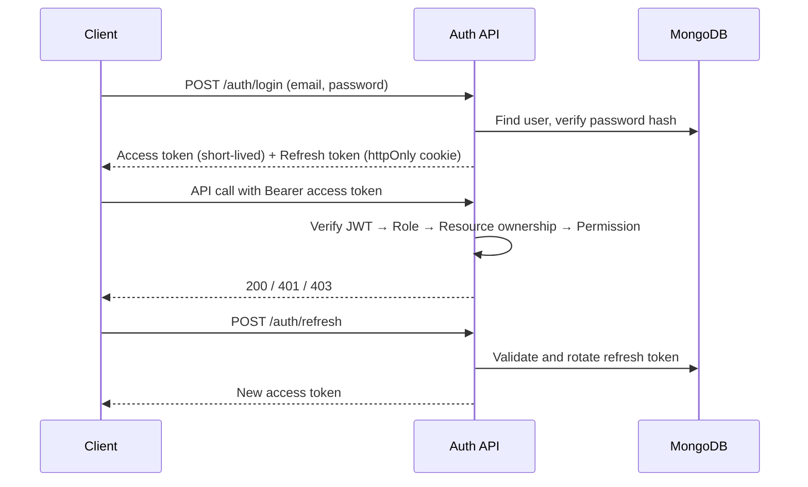

**Roles:** `SUPER_ADMIN`, `PLACEMENT_ADMIN`, `RECRUITER`, `STUDENT`

> The PRD's "Placement Officer" and "College Admin" workshop owners both map to `PLACEMENT_ADMIN`. Instructor accounts are not part of the MVP; the workshop's `instructor` is a descriptive field (name/contact) rather than a user account.

Every protected route verifies, in order:

1. **Authentication** — valid, unexpired JWT
2. **Role**
3. **Resource access** — students only their own data; recruiters only their company/drive; admins only their college (`collegeId` scoping)
4. **Permission** — fine-grained permission for the action

**Workshop-specific access rules (PRD §37)**

| Rule | Enforcement |
|---|---|
| Only authenticated, eligible students can register | Check enrollment/cohort membership server-side in `register` |
| No duplicate registration | Unique index `(workshopId, studentId)` |
| Capacity enforced | Atomic seat reservation (see §6.9) |
| Officer may override eligibility | `PLACEMENT_ADMIN` can add students manually; override recorded with actor and reason in `audit_logs` |
| Students never see another student's private performance data | Student endpoints return own records only; workshop-level numbers shown to students are **aggregates** with a minimum-group-size rule |

### 4.7 Cross-Cutting Concerns

| Concern | Approach |
|---|---|
| Validation | Zod/Joi schemas at middleware |
| Security | `helmet`, CORS allow-list, rate limiting, NoSQL-injection sanitization, file validation |
| Secrets | Environment variables only |
| Logging | Structured logs with request IDs |
| Auditing | `audit_logs` for sensitive actions (role changes, data exports, eligibility overrides, workshop cancellations, attendance edits) |
| Resilience | Timeouts, bounded retries with backoff, circuit breaker on AI providers |

---

## 5. Database Architecture

**Database:** MongoDB Atlas (replica set, automated backups, access controls, TLS). Multi-document transactions are available on Atlas replica sets and are used where noted.

### 5.1 Entity Relationships

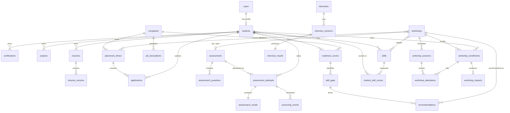

> **Core logical record:** `Student + Company → Readiness Record → Score + Risk + Stage Scores + Skill Gaps + Recommendations`
> **New logical record (v2):** `Student + Workshop → Enrollment → Attendance + Pre/Post Scores → Impact (skill Δ, readiness Δ, remaining gap)`

### 5.2 Collections

**From the PRD**

```text
users                  students               certifications         skills
projects               companies              job_descriptions       placement_drives
applications           assessments            assessment_questions   assessment_attempts
assessment_results     interviews             interview_sessions     interview_results
proctoring_events      readiness_scores       skill_gaps             recommendations
resumes                resume_versions        notifications          documents
reports                audit_logs
```

**Added for the workshop module (proposed)**

```text
workshops              workshop_sessions      workshop_enrollments
workshop_attendance    workshop_impacts       student_skill_scores
cohort_skill_stats
```

| New collection | Purpose |
|---|---|
| `workshops` | Definition, targeting rules, lifecycle state, schedule defaults, capacity, linked drives/skills/assessments |
| `workshop_sessions` | Individual dated sessions of a workshop (multi-session bootcamps) |
| `workshop_enrollments` | Student ↔ workshop: source (auto/self/manual), status, selection reason snapshot, waitlist position |
| `workshop_attendance` | Per student per session: present/absent, timestamp, marked-by |
| `workshop_impacts` | Per-student before/after record (skill scores, readiness, improvement, remaining gap, next recommendation) |
| `student_skill_scores` | Current and historical per-skill scores for each student (the PRD refers to skill scores being updated; this makes them a first-class, time-series record) |
| `cohort_skill_stats` | Pre-aggregated skill-gap counts by college/drive/branch/semester for fast analytics |

### 5.3 Embedding vs. Referencing

| Data | Strategy | Reason |
|---|---|---|
| Student education, links, contact info | **Embed** in `students` | Read together, bounded |
| Student skills (summary) | **Embed** summary; reference `skills` catalog | Fast profile reads, normalized taxonomy |
| Certifications, projects | **Reference** | Independent lifecycle, verification workflow |
| Company recruitment stages, required/preferred skills | **Embed** in `companies` / `job_descriptions` | Always read together |
| Assessment questions | **Reference** | Reused across assessments |
| Attempt answers | **Embed** in `assessment_attempts` | Written/read as a unit; autosave |
| Proctoring events | **Reference** | High volume, TTL retention |
| Readiness stage scores, gap list | **Embed** inside `readiness_scores` snapshot | One-document dashboard reads |
| Workshop targeting rules, schedule defaults, linked skill/drive IDs | **Embed** in `workshops` | Bounded, read with the workshop |
| Workshop enrollments | **Reference** (own collection) | Unbounded (hundreds per workshop), queried by student and by workshop |
| Workshop attendance | **Reference** | Grows with sessions × students |
| Seat counter (`enrolledCount`) | **Embed** in `workshops` | Needed for atomic capacity check |
| Selection reason snapshot | **Embed** in `workshop_enrollments` | Student must see *why* they were selected even if scores change later |

### 5.4 Example Documents

**`readiness_scores`**

```json
{
  "studentId": "…", "companyId": "…", "driveId": "…",
  "overall": 68, "category": "Developing", "risk": "MEDIUM",
  "stageScores": { "aptitude": 82, "technical": 61, "coding": 55, "interview": 74 },
  "components": {
    "skillMatch": 64, "academicEligibility": 100, "certificationRelevance": 40,
    "projectRelevance": 70, "resumeJdSimilarity": 66
  },
  "weightsVersion": "v1.0",
  "gaps": [
    { "skill": "DSA", "type": "weak", "priority": "HIGH" },
    { "skill": "SQL", "type": "missing", "priority": "HIGH" }
  ],
  "trigger": { "type": "WORKSHOP_POST_ASSESSMENT", "refId": "…" },
  "calculatedAt": "2026-10-06T10:00:00Z"
}
```

**`workshops`**

```json
{
  "_id": "…",
  "collegeId": "…",
  "title": "DSA + C++ Placement Bootcamp",
  "type": "DSA_CODING",
  "status": "REGISTRATION_OPEN",
  "targetSkills": [ { "skillId": "…", "requiredScore": 75 } ],
  "linkedDriveIds": ["…"],
  "targeting": {
    "skill": "Data Structures",
    "scoreBelow": 60,
    "gapPriority": ["HIGH", "CRITICAL"],
    "driveId": "…",
    "branches": ["CSE", "IT", "ECE"],
    "semesters": [], "cgpaMin": null,
    "readinessRange": null, "riskLevels": [],
    "manualIncludeIds": [], "manualExcludeIds": []
  },
  "autoEnroll": false,
  "waitlistEnabled": true,
  "capacity": 50,
  "enrolledCount": 47,
  "waitlistCount": 3,
  "instructor": { "name": "…", "contact": "…" },
  "mode": "CLASSROOM",
  "venue": "Block A, Room 204",
  "meetingLink": null,
  "preAssessmentId": "…",
  "postAssessmentId": "…",
  "cohortFrozenAt": "2026-10-08T09:00:00Z",
  "createdBy": "…",
  "createdAt": "…"
}
```

**`workshop_enrollments`**

```json
{
  "workshopId": "…", "studentId": "…",
  "source": "AUTO",                       // AUTO | SELF | MANUAL
  "status": "REGISTERED",                 // INVITED | REGISTERED | WAITLISTED | CANCELLED | COMPLETED | NO_SHOW
  "waitlistPosition": null,
  "selectionReason": {
    "skill": "Data Structures", "currentScore": 54, "requiredScore": 75,
    "priority": "HIGH", "driveId": "…", "cohortSizeAtSelection": 50
  },
  "overridden": false,
  "createdAt": "…"
}
```

**`workshop_impacts`**

```json
{
  "workshopId": "…", "studentId": "…",
  "attendance": { "sessionsAttended": 2, "sessionsTotal": 2, "rate": 1.0 },
  "completed": true,
  "skills": [
    { "skillId": "…", "pre": 54, "post": 78, "improvement": 24, "requiredScore": 75, "thresholdCleared": true }
  ],
  "readiness": { "driveId": "…", "before": 61, "after": 76 },
  "remainingGaps": [],
  "status": "GAP_IMPROVED",
  "nextRecommendationId": "…",
  "computedAt": "…"
}
```

**`proctoring_events`**

```json
{
  "sessionId": "…", "attemptId": "…", "studentId": "…",
  "type": "MULTIPLE_PERSONS", "timestamp": "2026-10-06T10:14:22Z",
  "confidence": 0.82, "evidenceRef": "s3://…/frame_0231.jpg",
  "reviewStatus": "PENDING"
}
```

### 5.5 Indexing

| Collection | Index |
|---|---|
| `users` | unique `email`, unique `username` |
| `students` | `collegeId + branch + semester`, `cgpa` |
| `readiness_scores` | unique `(studentId, companyId, driveId, calculatedAt)`; `(companyId, risk)`; `(risk, calculatedAt)` |
| `skill_gaps` | `(studentId)`, `(companyId, skill)`, `(collegeId, skillId, priority)` |
| `student_skill_scores` | `(studentId, skillId, measuredAt desc)`; `(collegeId, skillId, score)` — **supports cohort targeting queries** |
| `placement_drives` | `(status, startDate)`, `companyId` |
| `applications` | unique `(driveId, studentId)`; `(driveId, stage)` |
| `assessment_attempts` | unique `(assessmentId, studentId, attemptNo)`; `(status, expiresAt)` |
| `proctoring_events` | `(sessionId, timestamp)`; **TTL** on retention window |
| `workshops` | `(collegeId, status, startDate)`; `(linkedDriveIds)`; `(targetSkills.skillId)` |
| `workshop_enrollments` | **unique `(workshopId, studentId)`** (no duplicate enrollment); `(studentId, status)`; `(workshopId, status, waitlistPosition)` |
| `workshop_sessions` | `(workshopId, startAt)` |
| `workshop_attendance` | unique `(sessionId, studentId)`; `(workshopId, studentId)` |
| `workshop_impacts` | unique `(workshopId, studentId)`; `(workshopId, status)` |
| `cohort_skill_stats` | `(collegeId, driveId, skillId)`; `(collegeId, branch, semester, skillId)` |
| `notifications` | `(userId, read, createdAt)` |
| `audit_logs` | `(actorId, createdAt)`, `(resourceType, resourceId)` |

### 5.6 Data Lifecycle

- **Retention rules** for proctoring evidence, interview recordings and assessment data (TTL indexes + storage lifecycle policies).
- **Soft delete** for students/companies/workshops; hard-delete jobs honor privacy requests.
- **Versioned snapshots** for readiness and skill scores, which provide before/after comparisons for workshops without recomputation.
- **Backups:** Atlas continuous backup with point-in-time recovery.

### 5.7 Supporting Stores

| Store | Purpose |
|---|---|
| **Object storage** (S3-compatible) | Resumes, certificates, profile images, assessment assets, proctoring evidence, interview recordings, workshop materials/reports (private buckets, signed URLs) |
| **Redis** | Job queue (e.g., BullMQ), rate-limit counters, short-lived caches |

---

## 6. Workshop Intervention Architecture (PRD §37)

### 6.1 Workshop Lifecycle State Machine

PRD lifecycle: `Draft → Cohort Identified → Published → Registration Open → Registration Closed → In Progress → Completed → Evaluation → Impact Measured`

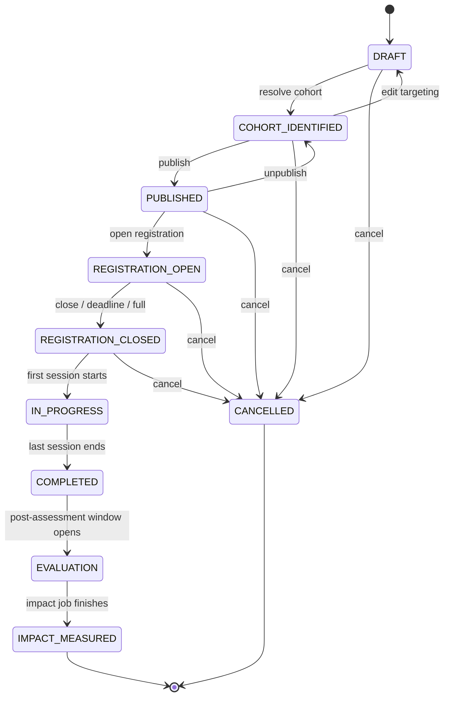

- Transitions are enforced in a single `WorkshopStateMachine` service; invalid transitions return `409`.
- Time-based transitions (registration deadline, session start/end) run via a scheduled worker.
- `CANCELLED` (FR-17) is an addition to the PRD's lifecycle **(proposed)**; cancellation notifies all enrolled students.
- Every transition writes to `audit_logs`.

### 6.2 Cohort Skill-Gap Analytics (FR-21)

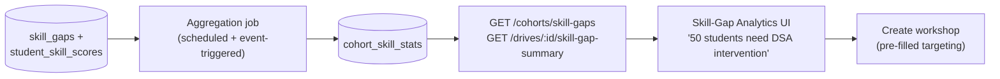

- **Why pre-aggregate:** the PRD requires <500 ms typical API response and dashboard aggregation APIs. Computing "students below threshold per skill per drive" over the whole student base on demand is expensive, so a worker maintains `cohort_skill_stats`. The refresh is triggered by readiness/skill-score changes and runs on a schedule as a safety net.
- **Outputs (per college, filterable by drive/branch/semester):** skill, affected-student count, rank, risk distribution, recommended intervention size, and `workshopNeeded` (Yes / Optional / Recommended, derived from affected count and gap priority thresholds that are configurable in Settings).
- **Drive view:** for an upcoming drive, requirement → student gaps → cohort analysis → workshop needed, matching the PRD's example table.

### 6.3 Cohort Targeting Engine

Targeting rules are translated into a MongoDB aggregation over `students`, `student_skill_scores`, `skill_gaps` and `readiness_scores`.

```text
Rule inputs (all optional, AND-combined):
  skill, scoreBelow / scoreRange, gapPriority[], driveId,
  branches[], semesters[], cgpaMin/Max, readinessRange, riskLevels[]
Manual overrides:
  manualIncludeIds (always added), manualExcludeIds (always removed)

Result:
  matchedStudentIds + per-student selectionReason snapshot
```

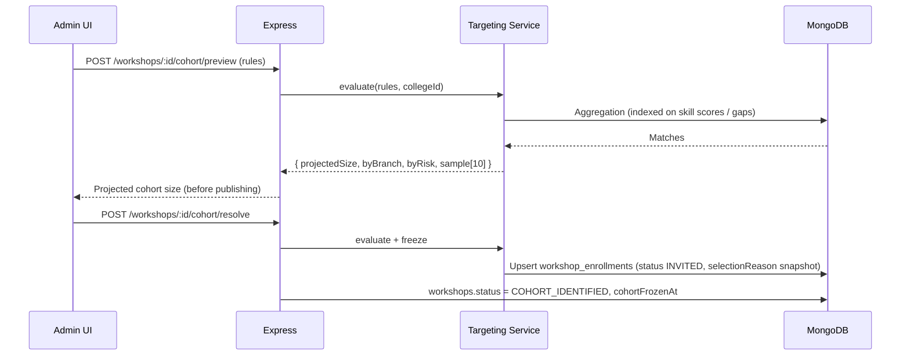

- **Preview vs. freeze:** previews are live; `resolve` snapshots the cohort and the selection reason so later score changes don't silently change who was invited. Admins can still add/remove manually (audited).
- **Privacy:** preview returns counts, distributions and a small sample for officers (who are authorized to view student data in their college); it never leaves the college boundary (`collegeId` scope).

### 6.4 Enrollment, Capacity and Waitlist (FR-18)

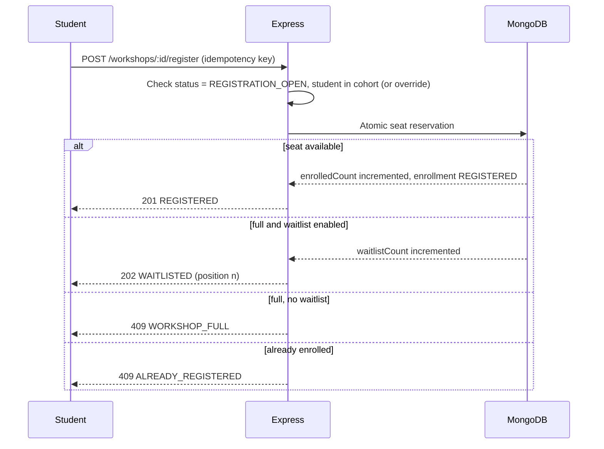

**Concurrency-safe capacity (the key risk):** many students may register at once the moment registration opens.

```js
// Atomic: only increments if a seat remains and registration is open
const w = await Workshop.findOneAndUpdate(
  { _id, status: 'REGISTRATION_OPEN', $expr: { $lt: ['$enrolledCount', '$capacity'] } },
  { $inc: { enrolledCount: 1 } },
  { new: true }
);
// then upsert enrollment; the unique (workshopId, studentId) index rejects duplicates.
// If the enrollment insert fails, compensate by decrementing — or wrap both in a transaction.
```

- The unique index is the real guard against duplicate enrollment; the application check is only for friendlier errors.
- **Waitlist promotion:** when a registered student cancels, a worker promotes the first waitlisted student and sends a notification, inside a transaction.
- **Auto-enroll (where configured):** after `resolve` and `publish`, a job converts `INVITED` enrollments to `REGISTERED` in capacity order; overflow follows the waitlist/officer decision.
- **Notifications (FR-18):** invitation on publish, confirmation, waitlist promotion, reminder before session, cancellation. Delivered in-app (`notifications`) and by email through a fan-out job so that notifying hundreds of students never blocks the API request.

### 6.5 Attendance (FR-19)

- Officers mark attendance per session through a **bulk upsert** (`PUT …/attendance`) keyed on `(sessionId, studentId)`, recording status, timestamp and the marking user.
- Attendance is **college-controlled**; the PRD does not call for student self check-in, so none is built in the MVP.
- Completion rule is configurable per workshop (for example, attendance ≥ X% of sessions and post-assessment submitted) **(proposed)**, evaluated when sessions close.
- Summary endpoint returns present/absent counts and attendance rate.
- Edits to attendance after the fact are allowed for officers and audited.

### 6.6 Pre/Post Assessment Integration (FR-20)

The workshop **reuses** the existing assessment module rather than introducing a second assessment system.

```text
workshops.preAssessmentId  ──►  assessments  (tagged with targetSkills, purpose: WORKSHOP_PRE)
workshops.postAssessmentId ──►  assessments  (tagged with targetSkills, purpose: WORKSHOP_POST)
```

- Assessment attempts carry `context: { workshopId, phase: 'PRE' | 'POST' }`, so results link back without duplicating storage.
- Skill-tagged questions produce **per-skill topic scores** (PRD §10.3: topic performance, weak/strong topics), which update `student_skill_scores`.
- Pre and post assessments should draw from **equivalent but non-identical** question sets (matched by skill, topic and difficulty) so that gains are not inflated by memorization **(proposed)**.
- Proctoring can be switched on per assessment as with any other assessment.
- Pre-assessment is optional per the PRD; without one, the "before" value is the latest `student_skill_scores` entry at enrollment time.

### 6.7 Impact Measurement Pipeline

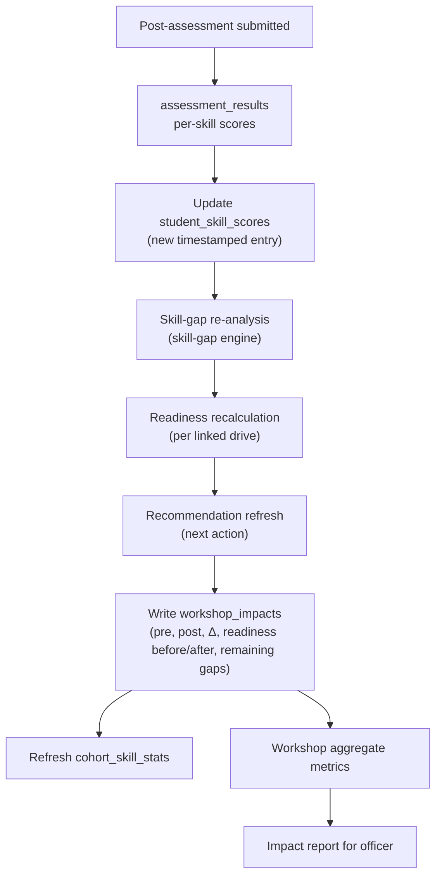

Triggered per student when a post-assessment is scored, and by `POST /workshops/:id/impact/compute` for the batch/aggregate pass. Both run as background jobs (PRD §18 async rule).

**Aggregate metrics (descriptive only)**

| Metric | Definition |
|---|---|
| Attendance rate | attended session-slots ÷ expected session-slots |
| Completion rate | students meeting the completion rule ÷ enrolled |
| Average skill improvement | mean(post − pre) over students with both scores |
| Average readiness improvement | mean(readiness after − before) |
| Threshold-cleared count | students whose post score ≥ required score |
| Remaining at-risk count | students still flagged at-risk for the linked drive |

**Statistical honesty (PRD requirement):** these are before/after descriptive statistics. The API labels them as such and the UI shows a note; metrics are computed only "where sufficient data exists" (minimum paired-score count configurable). Causal impact is not claimed unless the college runs a proper evaluation.

**Follow-up loop:** students who remain below threshold are surfaced in the report and can be assigned another intervention in one action, closing the PRD's "students needing more help are assigned another intervention" step.

### 6.8 Recommendation Engine Integration

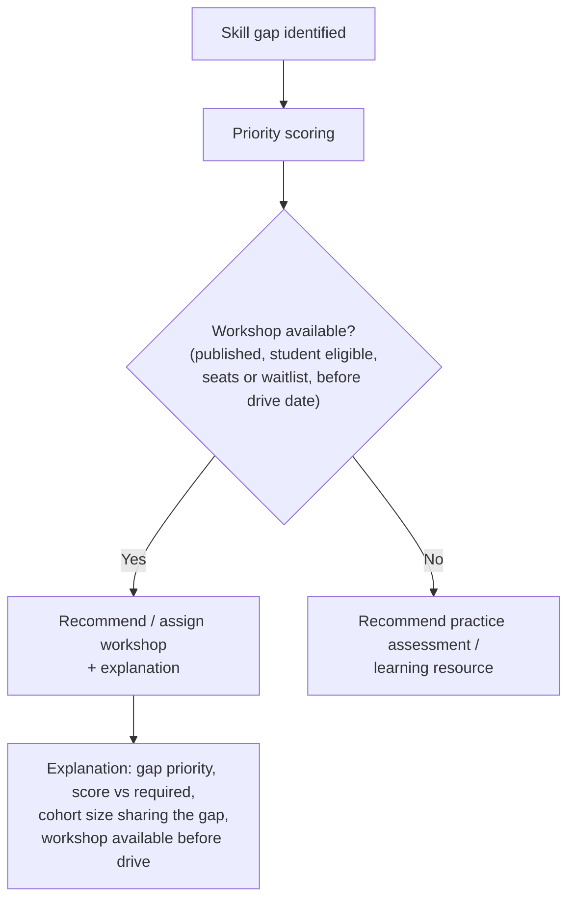

- **Recommendation payload** gains a `type: WORKSHOP` variant with `workshopId` and a structured `rationale` object (priority, current score, required score, cohort size, timing). The deterministic engine produces the structured rationale; the LLM may only rephrase it, so numbers shown to students always come from data.
- **Cohort statement privacy:** "42 students in your cohort share this gap" is an aggregate. A minimum group size (for example, hide counts below 5) prevents inadvertently identifying individuals **(proposed)**.
- Workshop availability is matched on skill, eligibility and timing relative to the drive date.

### 6.9 Workshop Data Flow (End-to-End Acceptance Scenario)

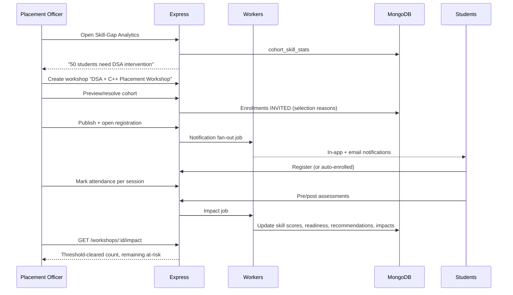

---

## 7. AI / ML Architecture

### 7.1 AI Layer Overview

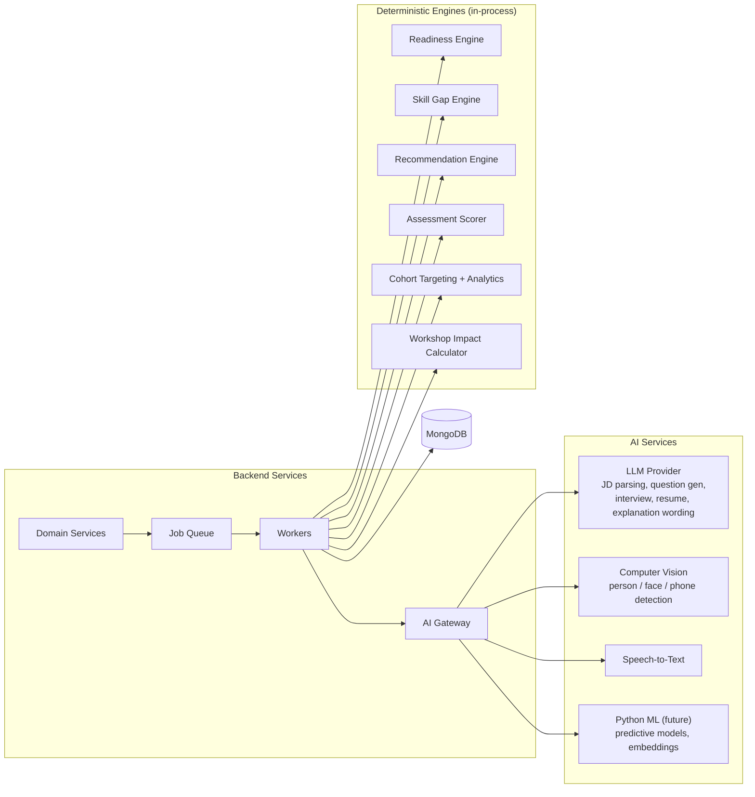

**Split of responsibility**

| Capability | Approach (MVP) | Why |
|---|---|---|
| Readiness scoring | **Deterministic weighted model** | Transparent, explainable (PRD §10.5) |
| Skill-gap detection | **Deterministic comparison** + LLM-assisted skill normalization | Repeatable results |
| Recommendations (incl. workshops) | **Rule-based prioritization** + LLM for wording | Priority from company need, skill importance, weakness, stage importance |
| Cohort targeting & analytics | **Deterministic queries/aggregations** | Must be exact and reproducible; LLM never selects students |
| Workshop impact | **Deterministic calculation** | Auditable before/after numbers |
| Assessment scoring | **Deterministic** for MCQ/coding; LLM for subjective answers | Fairness and consistency |
| JD parsing / company model | **LLM with strict JSON schema** | Unstructured text → structured requirements |
| Question generation | **LLM + validation workflow** | Must be validated before high-stakes use |
| Interviews | **LLM + STT** | Follow-ups, evaluation, feedback |
| Proctoring | **Computer-vision service** | Person/phone/multi-person detection |
| Resume generation | **LLM + fact validator** | Never fabricate qualifications |
| Predictive ML | **Future** (Python) | Needs historical placement data |

> Workshops add **no new LLM dependency**: cohort selection and impact measurement are deliberately deterministic so college decisions about who gets an intervention are explainable and auditable.

### 7.2 Asynchronous AI Job Pattern (PRD §18)

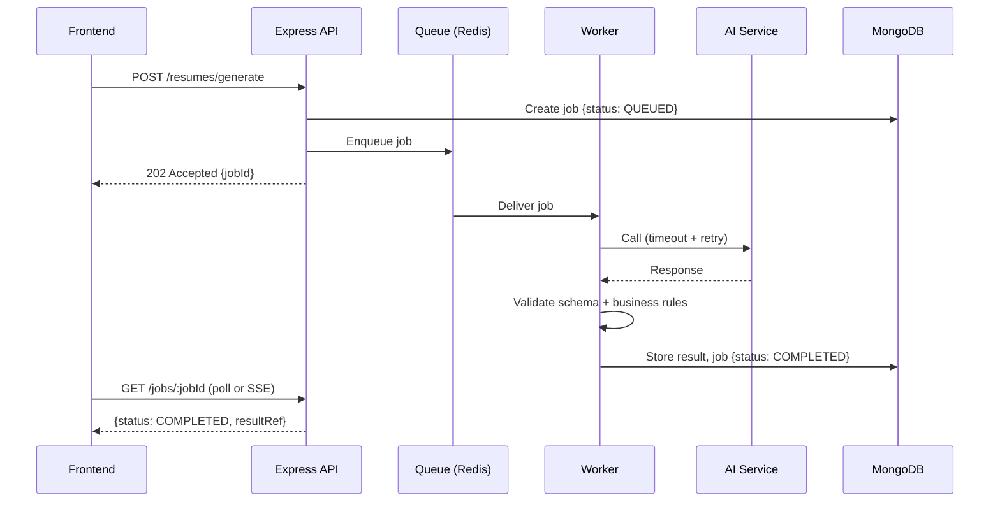

**Job states:** `QUEUED → PROCESSING → COMPLETED | FAILED | NEEDS_REVIEW`

**Job types:** `READINESS_CALC`, `SKILL_GAP_ANALYZE`, `RECOMMENDATION_GEN`, `RESUME_GEN`, `INTERVIEW_EVAL`, `QUESTION_GEN`, plus workshop-related `COHORT_STATS_REFRESH`, `WORKSHOP_NOTIFY`, `WAITLIST_PROMOTE`, `WORKSHOP_IMPACT`.

### 7.3 Readiness Engine

```text
Student Profile ┐
Company Reqs    ├──► Component Scorers ──► Weighted Aggregation ──► Score + Risk + Stage Readiness
Assessments     │
Interviews      │
Skill Gaps      ┘
```

| Component | Source |
|---|---|
| Skill match | Student skills vs. JD required/preferred skills (weighted by importance) |
| Academic eligibility | CGPA, branch, backlogs vs. drive criteria |
| Certification relevance | Verified certifications mapped to required skills |
| Project relevance | Project tech/skills vs. JD |
| Resume/JD similarity | Embedding or keyword similarity |
| Aptitude / Technical / Coding | Assessment results by topic (**including workshop pre/post results**) |
| Interview | Interview result scores |

**Aggregation:** `overall = Σ(wᵢ × componentᵢ)`, weights configurable per company/drive and stored with `weightsVersion`.

**Risk classification:** thresholds on overall and stage scores (`LOW`, `MEDIUM`, `HIGH`), plus a "blocking stage" flag.

**Explainability:** every record stores components, weights and top contributors ("why is my readiness 68%?").

**Recalculation triggers:** profile change, new certification, assessment/interview completion, **workshop post-assessment scored**, JD change, drive eligibility change. Bulk recalculation per drive runs as a background job.

### 7.4 Skill-Gap Engine

```text
Student Skills (profile + certs + projects + assessment evidence + student_skill_scores)
        vs.
Company/JD Required & Preferred Skills (normalized via skill taxonomy)
        ▼
Missing · Weak · Strong · Priority · Skill-match %
```

- **Normalization:** canonical `skills` collection with aliases (e.g., "JS" → "JavaScript"); LLM only proposes new mappings for review.
- **Weak vs. missing:** weak = present but low assessment/interview evidence; missing = no evidence.
- **Priority:** skill importance × gap size × stage importance; priority bands (`LOW/MEDIUM/HIGH/CRITICAL`) feed workshop targeting and the "workshop needed" decision.
- **Scoring against requirements:** the engine compares each student's current skill score to the drive's `requiredScore` (for example, DSA 54 vs. 75), which is the number surfaced in workshop invitations.

### 7.5 AI Assessment

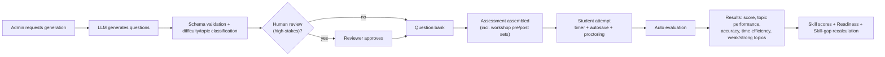

**Reliability guarantees**

- Answers autosaved periodically; attempt resumable after refresh/network loss.
- Server-authoritative timer; auto-submit on expiry.
- Idempotent submission to avoid duplicates and prevent loss.
- Adaptive question selection is a future extension.

### 7.6 AI Interview

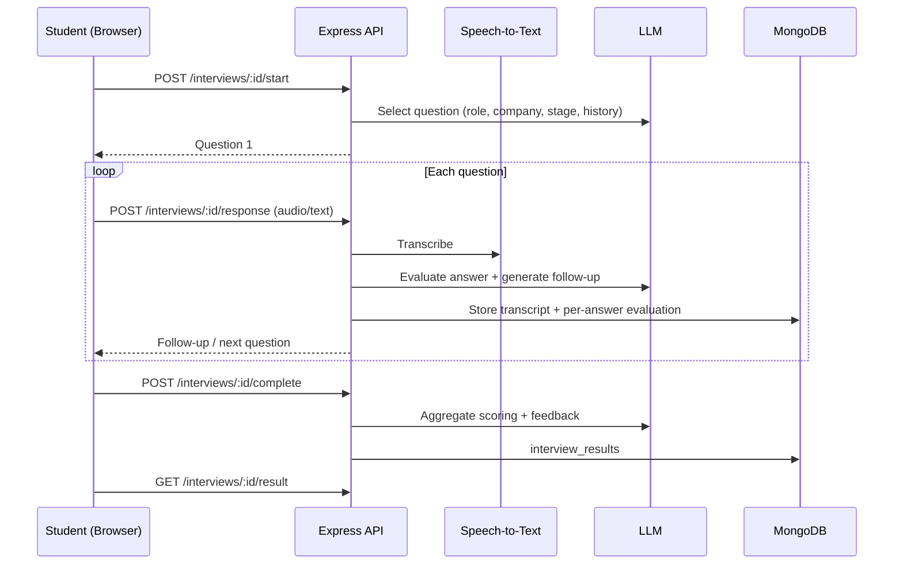

**Guardrails**

- Rubric: technical correctness, communication clarity, relevance, structure.
- **No inference of personality or protected characteristics.**
- Scores stored with rubric, model and prompt version.
- Graceful degradation: if the AI service is unavailable, the session pauses/saves state and resumes.

### 7.7 AI Proctoring

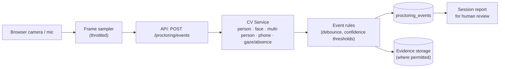

- **Signals:** presence/absence, multiple people, phone/device, looking away, camera/mic status.
- **Each event stores:** type, timestamp, confidence, evidence reference.
- **False-positive mitigation:** confidence thresholds, temporal smoothing across N frames, poor-lighting handling, and a **human review status** on every flagged event.
- **Not automatic proof:** reports support reviewers; no automatic disqualification.
- **Privacy:** explicit consent; defined retention (TTL); evidence only where permitted.

### 7.8 Resume Generation

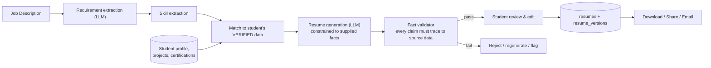

- The LLM receives only the structured, verified facts needed.
- The validator compares generated entities (employers, projects, certifications, dates, metrics, skills) against the source profile; anything unsupported is rejected.
- Each generation creates a `resume_versions` entry linked to the JD and profile snapshot.

### 7.9 AI Gateway & Safety Controls

| Control | Description |
|---|---|
| **Provider abstraction** | One interface for LLM/CV/STT; swap or fall back between providers |
| **Timeouts & retries** | Bounded retries with exponential backoff; circuit breaker |
| **Structured output** | JSON-schema enforced; malformed output → repair attempt → fail safely |
| **Prompt versioning** | Prompts stored and versioned; version recorded on every result |
| **Data minimization** | Only needed fields sent; no PII unless required and permitted by privacy policy |
| **Rate limiting & quotas** | Per-user / per-org limits; cost tracking |
| **Auditability** | Input hash, model, prompt version, output, latency logged |
| **Human in the loop** | Required for AI-generated high-stakes questions and flagged proctoring events |

### 7.10 Python ML Services (Optional, Later)

Introduced when ML tooling requires it (predictive stage-clearance models, embeddings, advanced proctoring models).

- Separate internal service, reachable only from the Node.js backend (private network, service token).
- Versioned REST/gRPC contract; Node remains the primary API.
- Training data: historical readiness snapshots, workshop impacts and placement outcomes exported from MongoDB.

---

## 8. End-to-End Data Flows

### 8.1 Student → Company Readiness

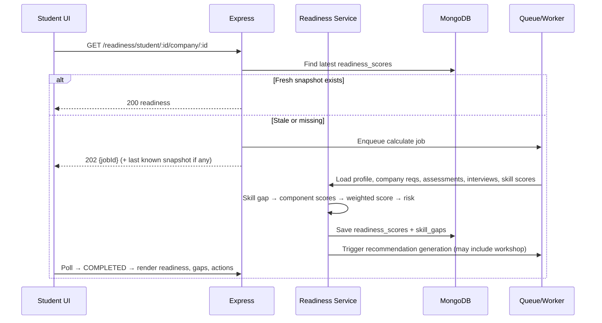

### 8.2 Intervention Loop (Placement Admin) — v2

```text
Skill-Gap Analytics: "50 students lack DSA; 37 lack C++"
   → Create workshop (targeting pre-filled from the gap)
   → Preview cohort size → freeze cohort → publish
   → Students notified; register or are auto-enrolled
   → Pre-assessment → sessions with attendance → post-assessment
   → Skill scores + readiness recalculated
   → Impact report: threshold-cleared, remaining at-risk
   → Remaining at-risk students assigned a follow-up intervention
   → Drive-level readiness updated before the drive
```

### 8.3 Assessment with Proctoring

```text
Start (POST /assessments/:id/start) → attempt created, timer fixed server-side
   ├─ Client: autosave answers every N sec → PATCH attempt
   ├─ Client: frames/events → POST /proctoring/events → CV → proctoring_events
   └─ Submit (POST /assessments/:id/submit, idempotent) or auto-submit on expiry
        → evaluation job → assessment_results (per-skill scores)
        → student_skill_scores updated
        → readiness + skill-gap recalculation
        → (if workshop attempt) workshop_impacts updated
        → results + proctoring report available for review
```

---

## 9. Deployment Architecture

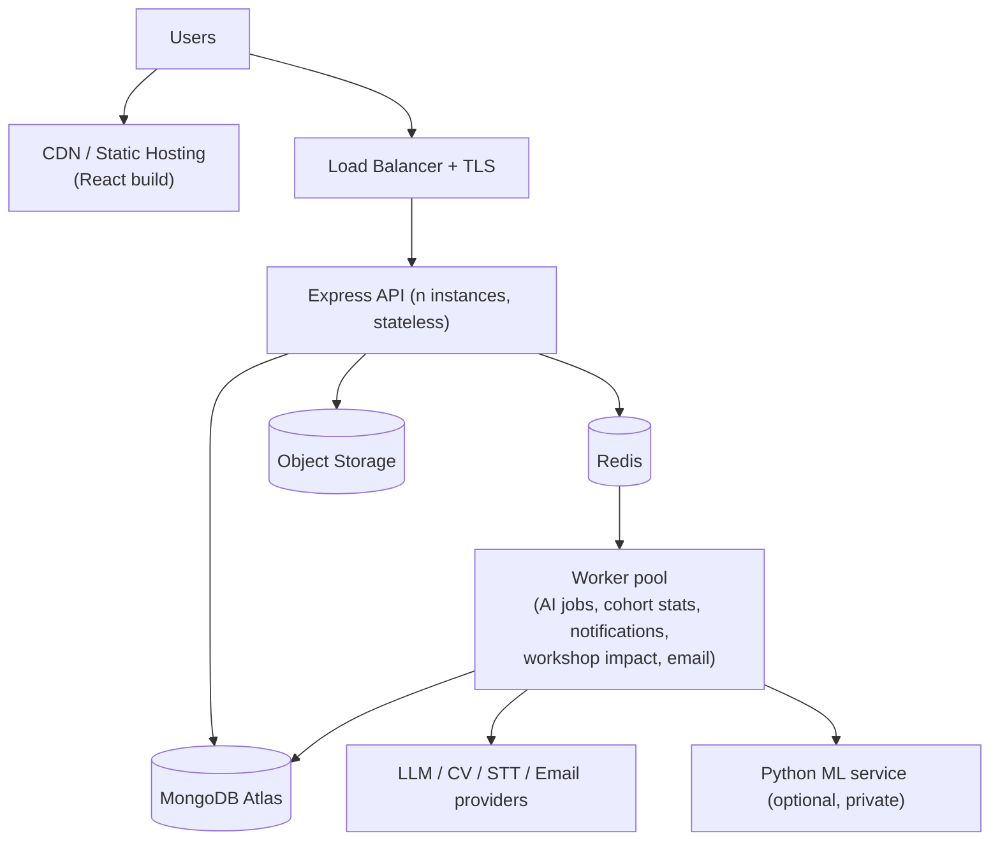

| Aspect | Approach |
|---|---|
| **Environments** | `dev`, `staging`, `prod`; environment-based config and secrets |
| **Scaling** | Stateless API instances behind a load balancer; workers scale on queue depth; separate worker pools for proctoring/interview load and for notification/analytics work |
| **Containers** | Docker images for API, workers, Python services |
| **Scheduler** | A single scheduled-job runner (e.g., BullMQ repeatable jobs) for workshop time transitions, cohort-stat refresh and session reminders; jobs are idempotent so multiple instances are safe |
| **CI/CD** | Lint → unit → integration → build → deploy |
| **Observability** | Structured logs, metrics (API success rate, latency, queue depth, AI latency/errors, workshop registration conflicts), alerting, request-ID tracing |
| **Performance targets** | Typical API < 500 ms; AI/analytics async; dashboards from pre-aggregated data |

---

## 10. Security & Privacy Architecture

| Area | Controls |
|---|---|
| **Transport** | HTTPS everywhere; HSTS |
| **Authentication** | JWT access (short-lived) + rotating refresh token (httpOnly, secure cookie); bcrypt/argon2 hashing |
| **Authorization** | RBAC + resource ownership + permission checks on every route; `collegeId` tenant scoping |
| **Input safety** | Schema validation, NoSQL-injection sanitization, output encoding, file type/size/content validation |
| **API protection** | Rate limiting (stricter on auth, AI, upload and registration endpoints), CORS allow-list, `helmet` |
| **Data protection** | Encryption at rest (Atlas, object storage), private buckets with signed URLs, secrets in env/secret manager |
| **Privacy** | Consent for camera/mic; retention/TTL policies; minimal data to AI providers; deletion support |
| **Workshop privacy** | Students see only their own scores and impact; cohort numbers shown to students are aggregates with a minimum group size; cohort previews and rosters are visible only to authorized officers in the same college |
| **Auditing** | `audit_logs` for auth events, exports, role changes, proctoring review decisions, **eligibility overrides, manual cohort edits, workshop cancellations and attendance edits** |
| **AI-specific** | Prompt-injection defenses for JD/resume text (untrusted data), schema-constrained outputs, no fabricated resume facts, bias-aware interview rubrics |

---

## 11. Error Handling & Resilience

| Failure | Behavior |
|---|---|
| Network loss during assessment | Local + server autosave; resume on reconnect; idempotent submit |
| Browser refresh | Attempt state restored from server; timer server-authoritative |
| Timer expiry | Server auto-submits saved answers |
| AI timeout / rate limit / outage | Retry with backoff → circuit breaker → job `FAILED` with retry option; user data preserved |
| Invalid / malformed model output | Schema validation → repair attempt → fail safely; never persist unvalidated output |
| Hallucinated resume content | Fact validator rejects; flagged for regeneration |
| Camera/mic denied | Clear UI state; policy-defined fallback (block, or allow with manual-review flag) |
| Proctoring false positives | Thresholds, smoothing, human review before any action |
| DB error | Retry transient errors; consistent error envelope; transactions for multi-step writes |
| **Concurrent workshop registration** | Atomic seat reservation + unique `(workshopId, studentId)` index; idempotency keys; deterministic `409` codes |
| **Workshop cancelled after enrollment** | Status transition + notification fan-out job; enrollments retained for history |
| **Cohort changes after publish** | Cohort frozen at `resolve`; later changes are explicit manual add/remove, audited |
| **Missing pre- or post-score** | Impact computed only for students with paired scores; others marked `INSUFFICIENT_DATA` rather than guessed |
| **Notification delivery failure** | Retry with backoff; in-app notification remains the source of truth; failures logged per recipient |
| **Skill-score update fails mid-pipeline** | Pipeline steps are idempotent and resumable; impact record stays `PENDING` until the readiness step completes |

---

## 12. Testing Strategy (Architecture Alignment)

| Layer | Focus |
|---|---|
| **Unit** | Controllers, services, validation, auth, readiness and skill-gap calculations, **workshop state machine, targeting rule evaluation, impact calculations** |
| **Integration** | Frontend → API, API → MongoDB, assessment/interview workflows, readiness pipeline, resume generation, **workshop enrollment, attendance, pre/post → readiness pipeline** |
| **Concurrency** | **Parallel registration at capacity, duplicate registration, waitlist promotion under cancellation** |
| **AI/ML evaluation** | Readiness quality, skill-extraction accuracy, recommendation relevance (including workshop vs. resource choice), interview-scoring consistency, proctoring precision/recall, resume/JD matching |
| **Security** | Unauthorized access, role escalation, invalid tokens, injection, rate limits, file validation, data exposure, **cross-student and cross-college data leakage in workshop endpoints** |

**Workshop acceptance test (from PRD §37)** — automate this scenario end-to-end:

```text
Seed 50 students with DSA < 60
  → analytics shows "50 students need DSA intervention"
  → officer creates workshop and resolves cohort (50 identified)
  → students notified; registration/auto-enroll succeeds, capacity respected
  → attendance recorded
  → pre/post assessments completed
  → skill scores updated, readiness recalculated
  → officer sees correct threshold-cleared count
```

AI components are tested against fixed evaluation datasets with pinned prompt/model versions.

---

## 13. Phased Delivery Mapping

| PRD Phase | Architecture components delivered |
|---|---|
| 1. Foundation | Vite/React shell, Express skeleton, MongoDB Atlas, config, auth, RBAC middleware |
| 2. Core Models | Students, certifications, skills, projects, companies, drives collections + CRUD; `student_skill_scores` |
| 3. Placement Mgmt | Applications, eligibility, dashboards, notifications, email integration |
| 4. Assessment | Question bank, attempts, timer, autosave, evaluation, results (with skill tagging) |
| 5. Readiness Intelligence | Readiness + skill-gap engines, risk classification, job queue/workers, `cohort_skill_stats` aggregation |
| 6. Recommendation Engine | Recommendation engine, **workshop recommendations**, reassessment loop |
| **Workshop module** *(v2; PRD §37 does not assign a phase — proposed after Phases 4–6, since it depends on assessments, skill scores, gaps and recommendations)* | Workshop CRUD + lifecycle, targeting engine, enrollment/waitlist, attendance, pre/post integration, impact pipeline, intervention reports |
| 7. AI Interview | AI Gateway (LLM), STT, interview services |
| 8. Proctoring | CV service integration, event pipeline, evidence storage, reports |
| 9. Resume Intelligence | JD parser, generator, fact validator, versioning, sender |
| 10. Analytics | Aggregation pipelines, reports, trends, **intervention analytics**, performance optimization |

---

## 14. Future Architecture Extensions

- **Predictive models** (stage-clearance, selection probability) via a Python ML service trained on historical outcomes and workshop impact data.
- **AI Placement Copilot** — conversational layer over readiness, skill-gap and workshop data with role-scoped retrieval ("Which students need a DSA workshop?").
- **Automated intervention planning** — automatically create student groups, workshops, mock tests, mock interviews and learning plans.
- **Instructor accounts** — optional, not in MVP; would add a role and instructor-scoped attendance.
- **Adaptive assessments** — dynamic difficulty selection.
- **Placement digital twin** — simulate intervention impact on drive readiness.
- **Integrations** — College ERP/LMS, GitHub, LinkedIn, calendar and video conferencing (workshop meeting links, reminders), NPTEL/Coursera/Udemy.
- **Real-time channel** — WebSocket/SSE for live job status, seat availability and notifications.

---

## 15. Key Architectural Decisions

| # | Decision | Rationale |
|---|---|---|
| 1 | Modular monolith (Express) with a separate worker process | Fast to build and maintain; easy to split later |
| 2 | Transparent weighted readiness model for MVP | Explainable; ML needs historical data first |
| 3 | AI Gateway abstraction | Provider independence, uniform retries, validation and audit |
| 4 | Async job pattern for AI/analytics | Meets <500 ms API target; resilient to AI latency |
| 5 | Readiness and skill scores stored as versioned snapshots | Enables progress tracking and before/after workshop comparison |
| 6 | Resume generation constrained and validated against verified data | Prevents fabricated qualifications |
| 7 | Proctoring as decision support with human review | Avoids unfair automated judgments |
| 8 | Embed vs. reference by query pattern | Optimizes reads; keeps unbounded data (events, enrollments, attendance) separate |
| 9 | **Cohort targeting and impact calculation are deterministic, not LLM-driven** | Who receives an intervention and how improvement is measured must be explainable and auditable |
| 10 | **Workshops reuse the assessment module for pre/post tests** | One scoring, proctoring and skill-score pipeline instead of two |
| 11 | **Atomic seat reservation + unique enrollment index** | Correct capacity and no duplicates under concurrent registration |
| 12 | **Cohort frozen at resolve time, with a selection-reason snapshot** | Students see a stable "why you were selected"; changes are explicit and audited |
| 13 | **Pre-aggregated `cohort_skill_stats`** | Keeps cohort analytics inside the performance target |
| 14 | **Impact metrics labeled descriptive, not causal** | Matches PRD §37; avoids overstating effectiveness |

---

## 16. Open Questions for Product Review

These are gaps in PRD v2 that affect the architecture; each has a default assumed above.

1. **Workshop APIs and phase placement** — the PRD defines FR-17–FR-21 but no routes or development phase. Proposed routes and phase are in §4.4 and §13.
2. **Skill scores** — the PRD says skill scores are updated after workshops but doesn't define the scoring model. Assumed: per-skill scores (0–100) derived from tagged assessment questions, stored in `student_skill_scores`.
3. **Required score per skill** — where does `requiredScore` (e.g., DSA 75) come from? Assumed: stored on the company/JD skill requirement and overridable per workshop.
4. **"Workshop needed" thresholds** — Yes / Optional / Recommended bands need definitions. Assumed: configurable college-level settings based on affected count and gap priority.
5. **Completion rule** — what counts as "completed" (attendance %, post-assessment)? Assumed: configurable per workshop.
6. **Multi-college tenancy** — assumed single-database multi-tenant with `collegeId` on every record, managed by `SUPER_ADMIN`.
7. **Student-visible cohort counts** — the "42 students share this gap" example discloses aggregate data; assumed acceptable with a minimum group-size rule.
